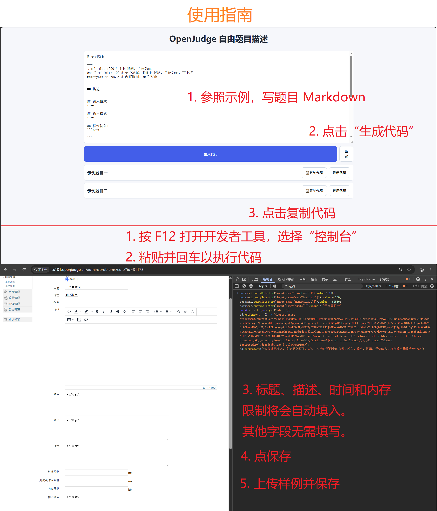

# OJ Inject
完全自定义 OpenJudge 题目描述

网站链接：[https://fuynaloft.github.io/oj-inject/](https://fuynaloft.github.io/oj-inject/)

使用方式：输入 Markdown，生成脚本，在 OpenJudge 题目编辑页的控制台执行，然后提交保存。直接 HTML 模式也支持自动复制生成代码。

V2 使用输入、输出、样例输入、样例输出四个字段保存 gzip + Base64 题面分块，提示保存同样编码的源码和加载器，描述只保存固定说明。不要手动修改这些载荷字段。标题、时间/内存限制和来源仍可正常编辑。旧版本的恢复脚本和 OJ 页面 localStorage 存储已移除，无兼容逻辑；旧题目需要用原始 Markdown/HTML 重新生成一次。

每个存储字段的上限为 65535 UTF-8 字节，包含包装标签和加载器。超过容量时生成会报错。frontmatter 中的 description、input、output、sampleInput、sampleOutput、hint 不再作为表单参数；请将其展示内容写入 Markdown 正文。

每题独立保存标题、frontmatter 和正文源码。开启“剔除标记内容”时，源码和题面都会去掉 `:::oj-remove` 容器及其内容；关闭时源码保留容器语法，题面正常渲染其内容。直接 HTML 模式原样保存 HTML 源码。

离线提取无需浏览器或第三方依赖，下载 [extract.mjs](./public/extract.mjs)，在 Node.js 中运行：

```sh
node extract.mjs page.html recovered
```

从完整的服务器页面 HTML，或保留数据节点的渲染后 HTML，输出 `recovered.html` 和 `recovered.md`。直接 HTML 模式第二个文件为 `recovered.source.html`。已有文件不会被覆盖。

格式约定：四个 `script[type="application/x-oj-inject-data"]` 节点带 `data-version="2"` 和 `data-part="0"` 到 `"3"`；按编号连接文本后，Base64 解码 → gzip 解压 → UTF-8 解码，即是最终 HTML。源码节点为 `script[type="application/x-oj-inject-source"]`，同样解码，`data-format` 为 `markdown` 或 `html`。数据脚本不执行，载荷和加载器均为单行，避免 OpenJudge 将换行转换为 `<br>`。

原版使用指南（截图中的恢复入口已取消）：

